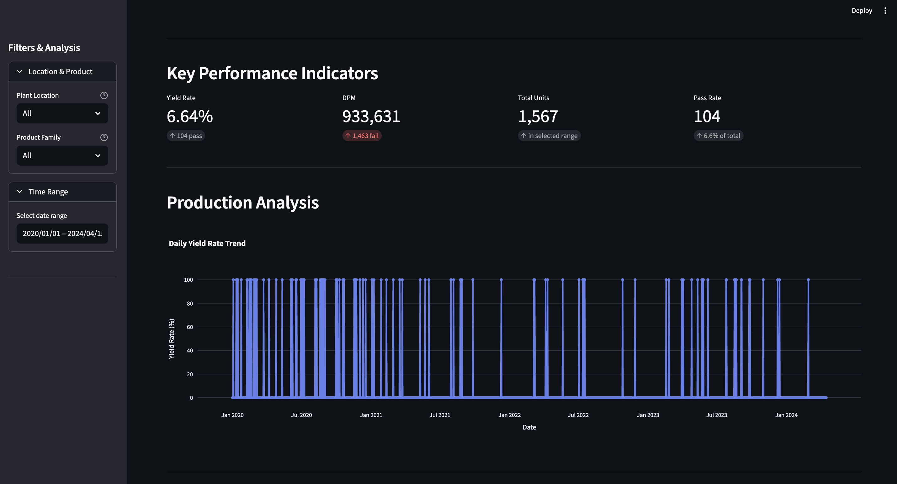
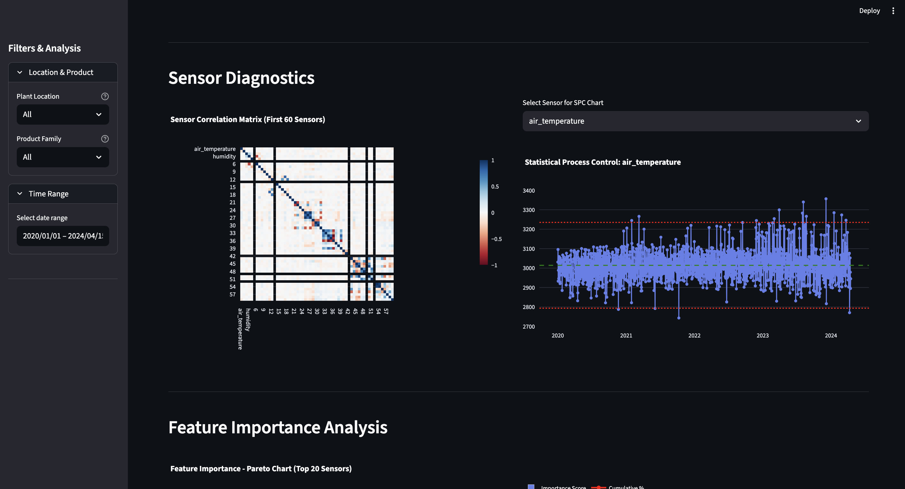
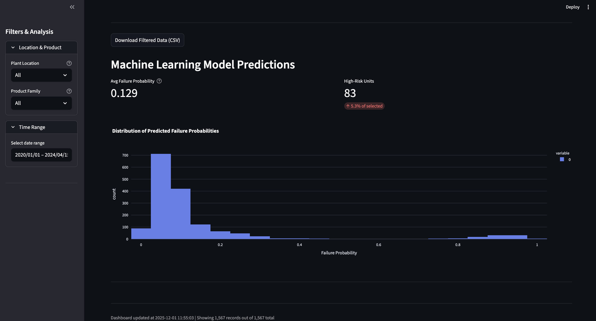

# Semiconductor Manufacturing Yield Analysis (Murata-style)

End-to-end data engineering and ML analytics for the UCI SECOM semiconductor dataset, augmented with Murata Manufacturing context. Demonstrates yield analysis, defect detection, and predictive modeling for improved semiconductor manufacturing performance.

## Dataset
- **UCI SECOM**: 1,567 wafer lots with 591 sensor measurements
- **Realistic Yield**: 6.6% pass rate (93% defect rate = 934k DPM)
- **Augmented Context**: plant location, product family, shift, batch ID
- **Business Value**: 1% yield improvement = $50M impact

## Features
- **Data Engineering**: ETL pipeline with Murata-inspired augmentations, sensor renaming, missing value imputation
- **Feature Engineering**: Lasso + RandomForest feature selection (591 → top 20-50 features)
- **Anomaly Detection**: Isolation Forest with statistical process control (SPC) charts
- **ML Prediction**: RandomForest classifier with SMOTE for imbalanced classes
- **Interactive Dashboard**: Streamlit app with KPIs, SPC charts, Pareto defect analysis, model predictions

## Project Structure
```
project/
├── data/
│   ├── raw/uci-secom.csv              # Raw UCI SECOM dataset
│   └── processed/
│       ├── secom_processed.csv         # Cleaned + augmented data
│       └── rf_model.pkl                # Trained RandomForest model
├── src/
│   ├── data_engineering.py             # ETL: load, augment, impute, save
│   ├── feature_engineering.py          # Feature selection (Lasso + RF)
│   ├── models.py                       # ML: anomaly detection + classifier
│   └── dashboard.py                    # Streamlit interactive dashboard
├── screenshots/                        # Dashboard screenshots and visualizations
├── requirements.txt                    # Python dependencies
└── README.md
```

## Quick Start
1. Install dependencies:
   ```bash
   pip install -r requirements.txt
   ```

2. Run ETL pipeline:
   ```bash
   python src/data_engineering.py
   ```
   Expected output:
   ```
   Saved processed CSV to data/processed/secom_processed.csv
   Summary metrics: {'total': 1567, 'passes': 104, 'fails': 1463, 'yield_rate': 6.6%, 'dpm': 933631}
   ```

3. Train models:
   ```bash
   python src/feature_engineering.py
   python src/models.py
   ```

4. Launch dashboard:
   ```bash
   streamlit run src/dashboard.py
   ```
   Opens at `http://localhost:8501`

## Key Metrics
- **Yield Rate**: (Pass / Total) × 100 = 6.6%
- **DPM**: (Fails / Total) × 1,000,000 = 933,631
- **FPY**: First Pass Yield (no rework assumed)
- **ROI**: Yield_Improvement% × $50M

## Dashboard Features
- **KPI Cards**: Overall yield %, DPM, units processed
- **Time Series**: Yield trends
- **SPC Chart**: Control limits (±3σ) for anomaly detection
- **Sensor Correlation Heatmap**: Feature relationships
- **Pareto Chart**: Top 20 defect contributors (80/20 analysis)
- **Model Predictions**: Failure probability distribution
- **Filters**: By plant, product family, date range
- **Export**: Download filtered CSV

## Screenshots

### Dashboard Overview


### KPI Metrics


### Feature Importance Analysis


### Detailed Rankings


## Tech Stack
- **Python 3.8**: Core language
- **Pandas / NumPy**: Data manipulation
- **scikit-learn**: ML algorithms (RandomForest, Lasso, IsolationForest)
- **imbalanced-learn**: SMOTE for class imbalance handling
- **Plotly**: Interactive visualizations
- **Streamlit**: Dashboard framework
- **joblib / pickle**: Model serialization

## Methodology
1. **Data Cleaning**: Interpolation + median imputation for 591 sensors
2. **Augmentation**: Add Murata context (plant, product, shift, batch)
3. **Feature Selection**: Combine Lasso and RF rankings → top 20-50 features
4. **Imbalance Handling**: SMOTE oversampling on training set
5. **Anomaly Detection**: Isolation Forest + SPC limits
6. **Classification**: RandomForest with class weights + 5-fold CV
7. **Visualization**: Interactive Streamlit dashboard with Plotly charts

## Notes
- CSV-based processing (no database required — portable)
- Pickle model serialization (compatible with Python 3.8)
- All data stored in `data/processed/` for easy versioning
- Modular design: run ETL, features, or models independently

## Future Enhancements
- Add XGBoost ensemble
- Implement SHAP model explainability
- Integrate time-series forecasting (ARIMA/Prophet)
- Database backend (PostgreSQL/SQLite)
- API endpoint for real-time predictions
